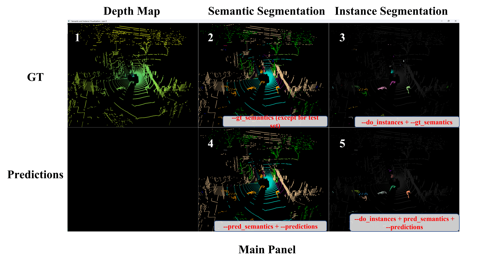
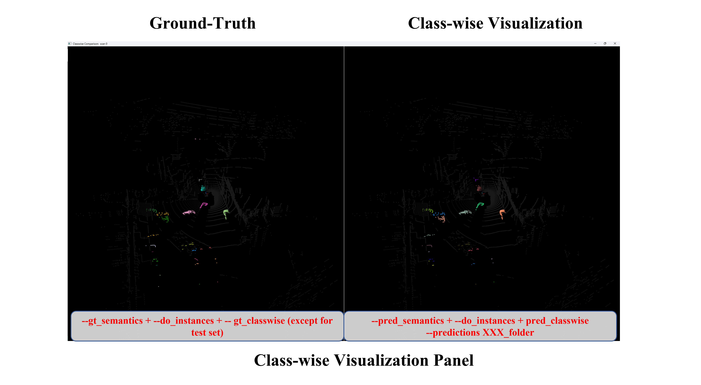
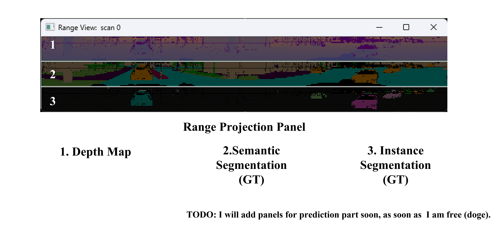
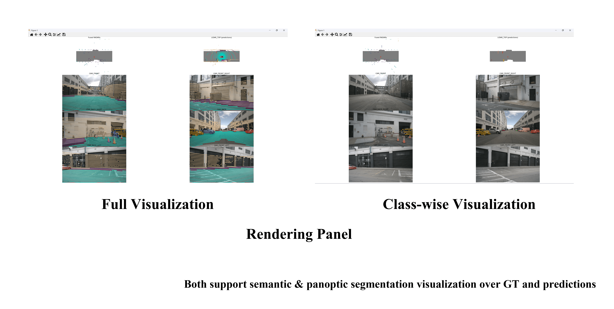
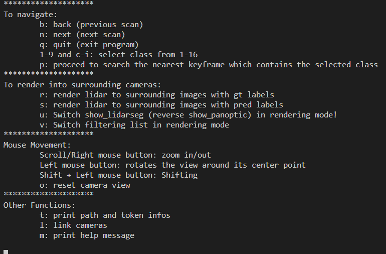

# API for NuScenes

## Overview












## Steup

This repository is modified based on Semantic-Kitti-API project(https://github.com/PRBonn/semantic-kitti-api) and adpated for nuscenes dataset.

Current Setup Processes(temporary):
- **Step-1** Prepare NuScenes Dataset
- **Step-2** Download PKL file from https://pan.baidu.com/s/1vgM20QA9ZbzDMvzKJIoJFQ?pwd=2rlo. Download `nuscenes_pkl` folder, which contains trainval, mini and test split.
- **Step-3** Can run on Windows(Windows 11 tested). Only need to install pip packages as the following. DO not need to ` sudo apt install python3-dev python3-pip python3-pyqt5.qtopengl` 
```sh
$ sudo pip3 install -r requirements.txt
```
However, **CANNOT** run on Ubuntu 20.04 and Ubuntu 22.04, due to compatability error of PyQt5 package in Ubuntu. Tryng to fix.

- **Step-4**
```sh
$ python visualize_panoptic.py \
--dataset Path-to-Nuscenes-dataset \
--version [v1.0-trainval|v1.0-mini|v1.0-test] \
--split [train|val] \
--pkl_path path/nuscenes_pkl/[trainval|mini|test] \
--predictions path_to_npz_label_files_folder \
--do_instances --gt_classwise --pred_classwise --render_lidar
```

e.g.
For v1.0-trainval / v1.0-mini
```sh
$ python visualize_panoptic.py 
--dataset path-to-NuScenes-dataset \
--version v1.0-trainval \ 
--split [train|val] \
--pkl_path path/nuscenes_pkl/[trainval|mini] \
--predictions path_to_npz_label_files_folder \ 
--do_instances --gt_classwise --pred_classwise --render_lidar # if --pred_classwise is set, --predictions XXX is needed
```

For v1.0-test
```sh
$ python visualize_panoptic.py \
--dataset path-to-NuScenes-dataset \
--version v1.0-test  \
--pkl_path path/nuscenes_pkl/test \
--predictions path_to_npz_label_files_folder \
--do_instances --pred_classwise --render_lidar # --gt_classwise does not work
```

For simplicity, you can refer to `scrips/visualize_panoptic.sh`.


## Functions

Lidarseg:

- Support LiDAR 3D visualization(point cloud rotation, scaling, shifting, reset)
- Support comparing between ground-truth and lidarseg segmentation

Panoptic:

- Support additionally visualizing pure *Thing* instances and making comparision between ground-truth and panoptic segmentation

Range Projections:

- Support visualizing original, lidarseg ground-truth, and panoptic range projections.
- TODO: Support visualizing predictions.

Common:

- Support filtering single category to visualize by pressing `0-9` and `A-G`
- Support searching the nearest frame filtered by single class by pressing `P`
- Support printing token and path information by pressing `T`
- use help by `python visiualize_panoptic.py -h`
- Support link different cameras across view together for synchronizations.

2D Rendering(`--render_lidar`):

- Support rendering LiDAR point cloud to surrounding cameras, with lidarseg or panoptic ground-truth labels or prediction labels.

- TODO: Can be easily extended to 2D video visualization of scenary, bird-eye-view visualization. Read nuscenes-devkit tutorial(https://github.com/nutonomy/nuscenes-devkit/blob/master/python-sdk/tutorials/nuscenes_lidarseg_panoptic_tutorial.ipynb) and make simple changes in `auxiliary/lasercanvis.py`.

You can refer to instructions by pressing `M` keys.

## Notes

1. `v1.0-test` can only support original point cloud visualization and predicted label visualization, which makes `--gt_classwise` no use.

2. `v1.0-trainval` can support original point cloud visualization,  ground-truth-label visualization, and predicted label visualization. When predicted labels are needed, remember to set `--predictions path-to-your-prediction-folders`. The folder is required to be formatted as following:

   ```
   FolderName:
       000260ba2925479eae65a7a9cb3567f5_panoptic.npz
       000a34bd16a641f2b0a86a7fee7c995d_panoptic.npz
       sample_token_panoptic.npz
   ```

3. The structure of `v1.0-mini` is similar to `v1.0-trainval`, which can take similar settings.